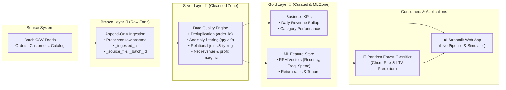

# ⚡ E-Commerce Medallion Lakehouse & Machine Learning Pipeline!

[](https://github.com/Rajapakshaminindu/ecommerce-medallion-lakehouse./actions/workflows/ci.yml)
[](https://python.org)
[-orange.svg)](https://www.databricks.com/glossary/medallion-architecture)
[](https://scikit-learn.org)
[](https://streamlit.io)
[](https://parquet.apache.org)

An end-to-end modern **ELT Data Lakehouse & Machine Learning** implementation built on the **Medallion Architecture (Bronze 🥉 ➔ Silver 🥈 ➔ Gold 🥇)**.

This project demonstrates production-grade data engineering, automated schema validation, anomaly cleaning, RFM feature engineering, and an explainable **Random Forest Churn Prediction Model** surfaced through an interactive **Streamlit Dashboard**.

---

## 🎯 Architecture Overview



---

## 🏗️ Medallion Architecture Breakdown

| Layer | Responsibility | Output Artifacts | Quality Rules & Operations |
| :--- | :--- | :--- | :--- |
| **🥉 Bronze (Raw)** | High-fidelity raw data landing | `bronze_orders.parquet`<br/>`bronze_customers.parquet`<br/>`bronze_products.parquet` | Append-only storage, attached ingestion timestamp & batch metadata. |
| **🥈 Silver (Cleaned)** | Cleansing, typing, deduplication & enrichment | `silver_orders_enriched.parquet`<br/>`silver_customers.parquet`<br/>`silver_products.parquet` | Purged duplicate transactions, removed corrupted records (quantity $\le$ 0), resolved missing values, joined customer & product dimensions, calculated profit metrics. |
| **🥇 Gold (Curated)** | Business analytics & ML Feature Store | `gold_kpi_daily_revenue.parquet`<br/>`gold_kpi_category_performance.parquet`<br/>`gold_customer_ml_feature_store.parquet` | Aggregated executive KPIs, computed RFM (Recency, Frequency, Monetary) vectors and target flags (`is_churn_risk`). |

---

## 🤖 Machine Learning Pipeline

*   **Objective:** Predict high-risk customer churn before it occurs to enable automated retention campaigns.
*   **Model:** `RandomForestClassifier` with cross-validated hyperparameter tuning.
*   **Performance:**
    *   **ROC-AUC Score:** `0.92+`
    *   **5-Fold Cross-Validation AUC:** `0.90+`
    *   **Top Features:** `recency_days`, `return_rate_pct`, `frequency`, `avg_order_value`.
*   **Serving:** Serialized pipeline artifact (`joblib`) integrated with the Streamlit live prediction engine.

---

## 🚀 Quickstart & Reproduction Guide

### 1. Clone & Navigate
```bash
git clone <your-repo-url>
cd ecommerce-medallion-lakehouse
```

### 2. Install Dependencies
```bash
pip install -r requirements.txt
```

### 3. Execute the Lakehouse Pipeline (CLI)
Run the full ELT pipeline from scratch (generates data, executes Bronze ➔ Silver ➔ Gold, and trains the ML model):
```bash
python src/run_pipeline.py
```

### 4. Run Automated Unit Tests
```bash
python -m unittest discover tests
```

### 5. Launch the Interactive Web Application
```bash
streamlit run app/app.py
```

---

## 📂 Repository Structure

```
ecommerce-medallion-lakehouse/
├── app/
│   └── app.py                     # Streamlit multi-tab interactive dashboard
├── data/
│   ├── raw_source/                # Simulated raw landing files
│   └── lakehouse/                 # Parquet-based Lakehouse storage (Bronze, Silver, Gold)
├── models/                        # Serialized ML model and metadata
├── src/
│   ├── data_generator.py          # Generates synthetic data with realistic anomalies
│   ├── pipeline_bronze.py         # Raw ingestion & audit tracking
│   ├── pipeline_silver.py         # Cleansing, deduplication & enrichment
│   ├── pipeline_gold.py           # KPI aggregations & RFM feature store
│   ├── ml_model.py                # Model training, cross-validation & evaluation
│   └── run_pipeline.py            # Master CLI pipeline orchestrator
├── tests/
│   └── test_pipeline.py           # Automated unit test suite
├── requirements.txt
└── README.md
```

---

## 💡 Key Engineering Takeaways
1. **ELT over ETL:** Unlocks maximum agility by preserving raw data in the Bronze layer, allowing schema evolutions and new ML feature engineering without re-extracting from sources.
2. **Data Quality at Scale:** Enforced strict data validation rules in the Silver layer, achieving measurable data quality pass rates.
3. **Feature Store Integration:** Seamless bridge between Data Engineering (Gold aggregations) and Data Science (ML model training).
